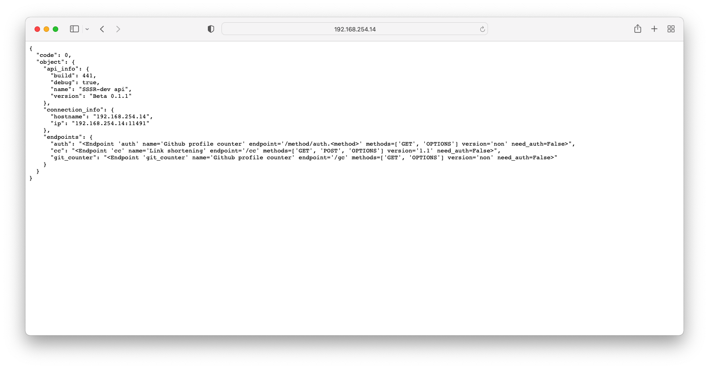

# api server

<p align="center">
    <a href="https://github.com/sssr-dev/api-server/blob/master/LICENSE"></a>    
    <a href="https://github.com/sssr-dev/api-server/stargazers"></a>    
    <a href="https://github.com/SantaSpeen"></a>
    <br/>
    <a href="./src/main.py">
        
    </a>
    <br/>
</p>

### Start

```shell
# Shell

$ git clone https://github.com/sssr-dev/api-server.git
  # Cloning repo
$ cd src
$ pip install -r requirements.txt
  # Install all dependents
$ python main.py
  # Start develop server
  
```

### Nginx configuration
```js
server {
    server_name sssr.dev www.sssr.dev;
    listen 80;
    listen 443;
    listen [::]:80;
    listen [::]:443;


    error_page 404 /;

    location / {
        root /var/www/sssr.dev;
        index index.html;
    }
}

server {
    server_name api.sssr.dev;
    listen 80;
    listen 443;
    listen [::]:80;
    listen [::]:443;

    location / {
        proxy_pass http://127.0.0.1:11491/;
        proxy_set_header Ng-Real-Ip $remote_addr;
        proxy_set_header Ng-Real-Hostname $host;    
    }
}
server {
    
    server_name cc.sssr.dev;
    listen 80;
    listen 443;
    listen [::]:80;
    listen [::]:443;
    
    location / {
        proxy_pass http://127.0.0.1:11491/cc?nginx=;   
        proxy_set_header Ng-Real-Ip $remote_addr;
        proxy_set_header Ng-Real-Hostname $host;  
    }
}
```